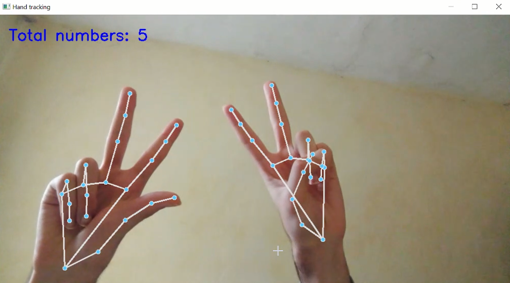

# Hand Tracking Project: Fingers Count 

## ✨ Description
Fingers Count is a real-time computer vision application that uses MediaPipe and OpenCV to detect hands and count the total number of fingers shown by both hands. This project demonstrates how powerful MediaPipe's hand tracking is when paired with the simplicity and speed of OpenCV, making it suitable for gesture-based interfaces or interactive applications.

## 🛠️ Technologies Used
- **🖐️ MediaPipe** – for hand landmark detection.
- **📷 OpenCV** – for video capture and drawing the landmarks.
- **🐍 Python** – as the main programming language.

## 📷 Screenshots

## 📬 Contact
[💼 LinkedIn ](www.linkedin.com/in/ismail-el-main) 
[🐙 GitHub ](https://github.com/ismail703)

