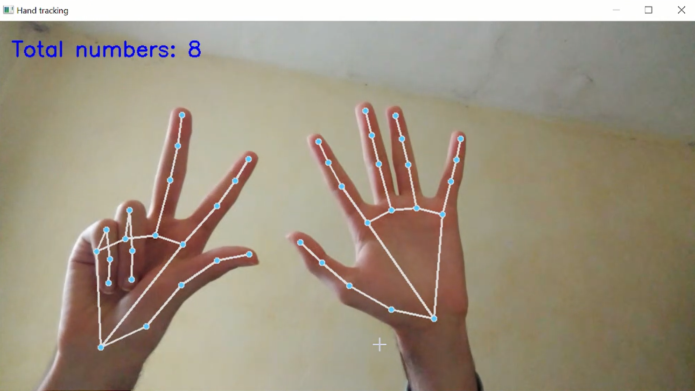

# Hand Tracking Project: Fingers Count 

## ✨ Description
FingerCount Pro is a real-time computer vision application that uses MediaPipe and OpenCV to detect hands and count the total number of fingers shown by both hands. Whether one hand shows one finger and the other shows two, the program will accurately detect and sum them up — in this case, returning 3.

This project demonstrates how powerful MediaPipe's hand tracking is when paired with the simplicity and speed of OpenCV, making it suitable for gesture-based interfaces or interactive applications.

🛠️ Technologies Used
🖐️ MediaPipe – for hand landmark detection.

📷 OpenCV – for video capture and drawing the landmarks.

🐍 Python – as the main programming language.

📷 Screenshots
You can add your screenshots here. For example:

Copier
Modifier
screenshots/
├── hand_tracking_example1.png
├── hand_tracking_example2.png
Then reference them in your README like:

markdown
Copier
Modifier

📬 Contact
For feedback or questions, feel free to reach out:

📧 Email: yourname@example.com
💼 LinkedIn: your-linkedin
🐙 GitHub: yourusername

Let me know if you want me to generate demo screenshots or customize the README further!

Vous avez dit :
